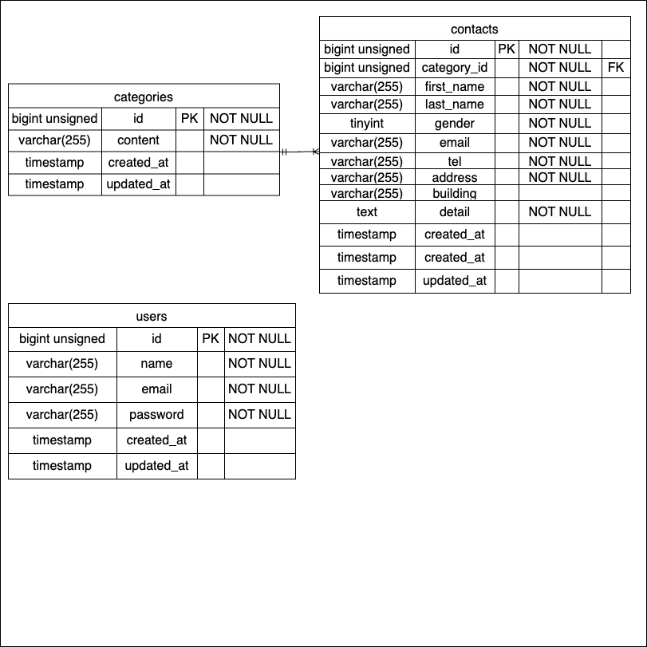

# お問い合わせフォーム

## 環境構築

### Dockerビルド
1. git clone https://github.com/mayuniwata/test.git
2. docker compose up -d --build

### Laravel環境構築
1. docker compose exec php bash
2. composer install
3. cp .env.example .env
4. php artisan key:generate

### マイグレーション
5. php artisan migrate

### シーディング
6. php artisan db:seed

---

## ER図

---

## 使用技術
- PHP
- Laravel
- MySQL
- Docker
